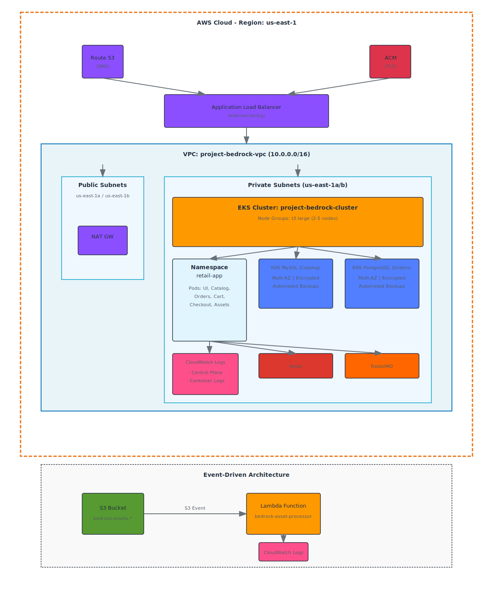

# Project Bedrock - InnovateMart EKS Infrastructure

[](https://www.terraform.io/)
[](https://aws.amazon.com/eks/)


## Overview

**Project Bedrock** is InnovateMart's production-grade Amazon EKS infrastructure for deploying microservices applications. This repository contains Infrastructure as Code (IaC) using Terraform to provision a complete, secure, and observable Kubernetes environment on AWS.


## Architecture

The infrastructure includes:

- **VPC**: Custom VPC with public and private subnets across 2 Availability Zones
- **EKS Cluster**: Kubernetes v1.31+ with managed node groups
- **IAM**: Least-privilege IAM roles and policies for cluster and developer access
- **Observability**: CloudWatch logging for control plane and container logs
- **Serverless**: S3 bucket with Lambda function for event-driven asset processing
- **RDS** (Bonus): Managed MySQL and PostgreSQL databases
- **ALB** (Bonus): Application Load Balancer with Ingress controller

### Architecture Diagram

[](High-Level Architecture Diagram)

```
┌─────────────────────────────────────────────────────────────┐
│                         AWS Cloud                            │
│                       Region: us-east-1                      │
└─────────────────────────────────────────────────────────────┘
                              │
          ┌───────────────────┴───────────────────┐
          │                                        │
    ┌─────▼──────┐                        ┌──────▼─────┐
    │  Route 53  │                        │    ACM     │
    │    (DNS)   │                        │   (TLS)    │
    └─────┬──────┘                        └──────┬─────┘
          │                                       │
    ┌─────▼───────────────────────────────────────▼─────┐
    │           Application Load Balancer                │
    │              (Internet-facing)                     │
    └─────┬──────────────────────────────────────────────┘
          │
    ┌─────▼────────────────────────────────────────────┐
    │         VPC: project-bedrock-vpc                 │
    │            CIDR: 10.0.0.0/16                     │
    └──────────────────────────────────────────────────┘
          │
          ├─────────────────────────────────────────────┐
          │                                              │
    ┌─────▼──────┐                              ┌──────▼─────┐
    │  Public    │                              │  Private   │
    │  Subnets   │                              │  Subnets   │
    │            │                              │            │
    │ us-east-1a │                              │ us-east-1a │
    │ us-east-1b │                              │ us-east-1b │
    └─────┬──────┘                              └──────┬─────┘
          │                                            │
    ┌─────▼──────┐                              ┌─────▼──────────────┐
    │   NAT GW   │                              │  EKS Cluster       │
    │            │                              │  project-bedrock-  │
    │            │                              │  cluster           │
    └────────────┘                              │                    │
                                                │  Node Groups       │
                                                │  - t3.large        │
                                                │  - 2-5 nodes       │
                                                └─────┬──────────────┘
                                                      │
                        ┌─────────────────────────────┼─────────────────────────┐
                        │                             │                         │
                  ┌─────▼──────┐            ┌────────▼────────┐      ┌────────▼────────┐
                  │  Namespace │            │   RDS MySQL     │      │ RDS PostgreSQL  │
                  │ retail-app │            │   (Catalog)     │      │   (Orders)      │
                  │            │            │                 │      │                 │
                  │ Pods:      │            │ Multi-AZ        │      │ Multi-AZ        │
                  │ - UI       │            │ Encrypted       │      │ Encrypted       │
                  │ - Catalog  │◄───────────┤ Automated       │      │ Automated       │
                  │ - Orders   │            │ Backups         │      │ Backups         │
                  │ - Cart     │────────────┤                 │      │                 │
                  │ - Checkout │            └─────────────────┘      └─────────────────┘
                  │ - Assets   │
                  └────────────┘
                        │
          ┌─────────────┼─────────────┐
          │             │             │
    ┌─────▼──────┐ ┌───▼────┐  ┌────▼─────┐
    │  CloudWatch│ │  Redis │  │ RabbitMQ │
    │   Logs     │ │        │  │          │
    │            │ └────────┘  └──────────┘
    │ - Control  │
    │   Plane    │
    │ - Container│
    │   Logs     │
    └────────────┘

┌──────────────────────────────────────────────────────────┐
│               Event-Driven Architecture                   │
│                                                           │
│  ┌──────────┐      S3 Event     ┌────────────────┐      │
│  │    S3    │─────────────────►  │    Lambda      │      │
│  │  Bucket  │                    │   Function     │      │
│  │          │                    │                │      │
│  │ bedrock- │                    │ bedrock-asset- │      │
│  │ assets-* │                    │ processor      │      │
│  └──────────┘                    └────────┬───────┘      │
│                                           │              │
│                                  ┌────────▼─────────┐    │
│                                  │   CloudWatch     │    │
│                                  │   Logs           │    │
│                                  └──────────────────┘    │
└──────────────────────────────────────────────────────────┘
```

## Repository Structure

```
bedrock-infra/
├── terraform/                    # Terraform infrastructure code
│   ├── main.tf                  # Main configuration
│   ├── providers.tf             # Provider configurations
│   ├── variables.tf             # Input variables
│   ├── outputs.tf               # Output values
│   ├── backend.tf               # Remote state backend
│   └── modules/                 # Terraform modules
│       ├── vpc/                 # VPC and networking
│       ├── eks/                 # EKS cluster
│       ├── iam/                 # IAM users and roles
│       ├── k8s-rbac/           # Kubernetes RBAC
│       ├── observability/       # CloudWatch logging
│       ├── serverless/          # S3 and Lambda
│       ├── rds/                 # RDS databases (bonus)
│       └── alb-controller/      # ALB controller (bonus)
├── k8s/                         # Kubernetes manifests
│   ├── retail-app-values.yaml   # Helm values for app
│   ├── retail-app-values-rds.yaml # Helm values with RDS
│   ├── db-secrets.yaml          # Database secrets
│   └── ingress.yaml             # Ingress configuration
├── lambda/                      # Lambda function code
│   └── asset_processor.py       # Asset processor function
├── scripts/                     # Deployment scripts
│   ├── setup-backend.sh         # Backend setup (bash)
│   ├── setup-backend.ps1        # Backend setup (PowerShell)
│   ├── deploy-app.sh            # App deployment (bash)
│   ├── deploy-app.ps1           # App deployment (PowerShell)
│   └── cleanup.sh               # Cleanup script
├── .github/
│   └── workflows/
│       └── terraform.yml        # CI/CD pipeline
├── docs/                        # Documentation
│   ├── DEPLOYMENT_GUIDE.md      # Detailed deployment guide
│   └── ARCHITECTURE.md          # Architecture details
├── README.md                    # This file
└── grading.json                 # Terraform outputs for grading
```

## Quick Start

### Prerequisites

Before you begin, ensure you have the following installed:

- **AWS CLI** v2.x ([Install](https://aws.amazon.com/cli/))
- **Terraform** v1.5+ ([Install](https://www.terraform.io/downloads))
- **kubectl** v1.28+ ([Install](https://kubernetes.io/docs/tasks/tools/))
- **Helm** v3.13+ ([Install](https://helm.sh/docs/intro/install/))
- **Git** ([Install](https://git-scm.com/downloads))

### AWS Configuration

Configure your AWS credentials:

```bash
aws configure
```

Ensure you have appropriate IAM permissions to create:
- VPC, Subnets, NAT Gateways
- EKS clusters and node groups
- IAM roles and policies
- S3 buckets
- Lambda functions
- RDS instances
- Load Balancers

### Step 1: Clone the Repository

```bash
git clone https://github.com/ififrank2013/bedrock-infra.git
cd bedrock-infra
```

### Step 2: Setup Backend

Initialize the Terraform backend (S3 + DynamoDB):

**On Linux/macOS:**
```bash
cd scripts
chmod +x setup-backend.sh
./setup-backend.sh
```

**On Windows (PowerShell):**
```powershell
cd scripts
.\setup-backend.ps1
```

### Step 3: Deploy Infrastructure

```bash
cd terraform
terraform init
terraform plan
terraform apply
```

**Estimated time**: 15-20 minutes

### Step 4: Configure kubectl

```bash
aws eks update-kubeconfig --name project-bedrock-cluster --region us-east-1
kubectl get nodes
```

### Step 5: Deploy Application

**On Linux/macOS:**
```bash
cd ../scripts
chmod +x deploy-app.sh
./deploy-app.sh
```

**On Windows (PowerShell):**
```powershell
cd ..\scripts
.\deploy-app.ps1
```

### Step 6: Access the Application

Get the ALB URL:

```bash
kubectl get ingress -n retail-app
```

Access the application at: `http://<ALB-DNS-NAME>`

## Configuration

### Key Resources

| Resource | Name | Purpose |
|----------|------|---------|
| EKS Cluster | `project-bedrock-cluster` | Kubernetes control plane |
| VPC | `project-bedrock-vpc` | Network isolation |
| Namespace | `retail-app` | Application isolation |
| IAM User | `bedrock-dev-view` | Developer read-only access |
| S3 Bucket | `bedrock-assets-alt-soe-025-0275` | Asset storage |
| Lambda | `bedrock-asset-processor` | Event processing |

### Terraform Variables

You can customize the deployment by modifying variables in `terraform/variables.tf` or creating a `terraform.tfvars` file:

```hcl
aws_region           = "us-east-1"
cluster_name         = "project-bedrock-cluster"
cluster_version      = "1.31"
node_instance_types  = ["t3.large"]
enable_rds           = true
enable_alb_ingress   = true
```

## Security

### IAM Developer Access

The `bedrock-dev-view` user has:
- **AWS Console**: ReadOnlyAccess policy for viewing resources
- **Kubernetes**: Read-only access via RBAC (view ClusterRole)

**Test access:**
```bash
# Configure AWS CLI with developer credentials
aws configure --profile bedrock-dev

# Configure kubectl
aws eks update-kubeconfig --name project-bedrock-cluster --region us-east-1 --profile bedrock-dev

# These should work (read operations)
kubectl get pods -n retail-app
kubectl get nodes
kubectl describe pod <pod-name> -n retail-app

# These should fail (write operations)
kubectl delete pod <pod-name> -n retail-app  # Forbidden
kubectl apply -f manifest.yaml               # Forbidden
```

### Network Security

- **Private Subnets**: EKS nodes run in private subnets
- **NAT Gateways**: Outbound internet access for nodes
- **Security Groups**: Least-privilege ingress/egress rules
- **Encryption**: S3 and RDS encryption enabled

## Observability

### CloudWatch Logging

**Control Plane Logs:**
- API server logs
- Audit logs
- Authenticator logs
- Controller manager logs
- Scheduler logs

**Container Logs:**
- Application logs via CloudWatch Observability add-on
- Lambda function logs

**View logs:**
```bash
# In AWS Console: CloudWatch > Log Groups
# Or via CLI:
aws logs tail /aws/eks/project-bedrock-cluster/cluster --follow
aws logs tail /aws/lambda/bedrock-asset-processor --follow
```

### Monitoring

```bash
# Check pod health
kubectl get pods -n retail-app

# Check pod logs
kubectl logs -f <pod-name> -n retail-app

# Check events
kubectl get events -n retail-app --sort-by='.lastTimestamp'
```

## Testing

### Test Lambda Function

Upload a test file to S3:

```bash
echo "Test image" > test-image.jpg
aws s3 cp test-image.jpg s3://bedrock-assets-alt-soe-025-0275/
```

Check CloudWatch Logs:
```bash
aws logs tail /aws/lambda/bedrock-asset-processor --follow
```

You should see: `Image received: test-image.jpg`

### Test Application

```bash
# Get ALB URL
ALB_URL=$(kubectl get ingress retail-app-ingress -n retail-app -o jsonpath='{.status.loadBalancer.ingress[0].hostname}')

# Test HTTP endpoint
curl http://$ALB_URL

# Or open in browser
echo "Application URL: http://$ALB_URL"
```

### Test Developer Access

See the [Security](#-security) section above for testing IAM and RBAC permissions.

## CI/CD Pipeline

The GitHub Actions workflow automates:

1. **On Pull Request**:
   - Terraform format check
   - Terraform validation
   - Terraform plan
   - Comment plan results on PR

2. **On Merge to Main**:
   - Terraform apply
   - Generate `grading.json`
   - Deploy retail application
   - Output application URL

### Setup GitHub Secrets

Add the following secrets to your GitHub repository:

- `AWS_ACCESS_KEY_ID`: Your AWS access key
- `AWS_SECRET_ACCESS_KEY`: Your AWS secret key

**Settings > Secrets and variables > Actions > New repository secret**

## Bonus Features

### RDS Managed Databases

- **MySQL RDS**: For Catalog service
- **PostgreSQL RDS**: For Orders service
- **Multi-AZ**: High availability
- **Automated Backups**: 7-day retention
- **Secrets Manager**: Secure credential storage

**Enable RDS:**
Set `enable_rds = true` in `terraform/variables.tf` (default)

### ALB with TLS

- **AWS Load Balancer Controller**: Installed via Helm
- **Ingress**: Automatic ALB provisioning
- **TLS**: Optional ACM certificate integration

**Enable HTTPS:**
1. Request ACM certificate in us-east-1
2. Update `k8s/ingress.yaml` with certificate ARN
3. Uncomment HTTPS annotations

## Outputs

After successful deployment, retrieve outputs:

```bash
cd terraform
terraform output

# Or generate JSON for grading
terraform output -json > ../grading.json
```

**Key Outputs:**
- `cluster_endpoint`: EKS API server endpoint
- `cluster_name`: EKS cluster name
- `region`: AWS region
- `vpc_id`: VPC identifier
- `assets_bucket_name`: S3 bucket name
- `developer_access_key_id`: IAM user access key (sensitive)
- `developer_secret_access_key`: IAM user secret (sensitive)

## Cleanup

**WARNING**: This will delete all resources!

```bash
cd scripts
chmod +x cleanup.sh
./cleanup.sh
```

Or manually:
```bash
cd terraform
terraform destroy
```

## Documentation

- [Deployment Guide](docs/DEPLOYMENT_GUIDE.md) - Detailed step-by-step guide
- [Architecture Details](docs/ARCHITECTURE.md) - In-depth architecture information

## Troubleshooting

### EKS Cluster Not Accessible

```bash
# Verify AWS credentials
aws sts get-caller-identity

# Update kubeconfig
aws eks update-kubeconfig --name project-bedrock-cluster --region us-east-1

# Check cluster status
aws eks describe-cluster --name project-bedrock-cluster --region us-east-1
```

### Pods Not Starting

```bash
# Check pod status
kubectl get pods -n retail-app

# Describe pod for details
kubectl describe pod <pod-name> -n retail-app

# Check logs
kubectl logs <pod-name> -n retail-app
```

### ALB Not Provisioned

```bash
# Check ingress status
kubectl describe ingress retail-app-ingress -n retail-app

# Check ALB controller logs
kubectl logs -n kube-system deployment/aws-load-balancer-controller
```

### Lambda Not Triggering

```bash
# Check S3 bucket notification configuration
aws s3api get-bucket-notification-configuration --bucket bedrock-assets-alt-soe-025-0275

# Check Lambda function
aws lambda get-function --function-name bedrock-asset-processor
```

## Contributing

This is an assessment project. Contributions are not accepted at this time.

## License

This project is licensed under the MIT License.

## Author

**Student**: Ifeanyi Ike  
**Disclaimer**: This repository was just to deploy a demo Retail store app. All resources deployed would be destroyed after grading.

## Acknowledgments


For issues or questions related to this project:
1. Check the [Troubleshooting](#troubleshooting) section
2. Review the documentation in `/docs`
3. Open an issue on GitHub

---


## Support

For issues or questions related to this project:
1. Check the [Troubleshooting](#troubleshooting) section
2. Review the documentation in `/docs`
3. Open an issue on GitHub

---

**Last Updated**: February 2026  
**Version**: 1.0.0
